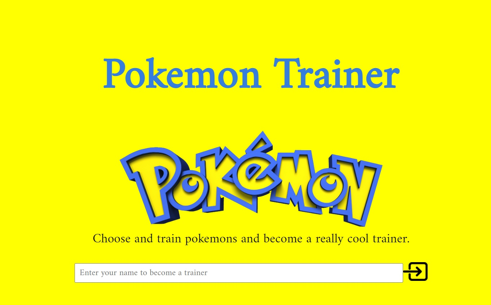
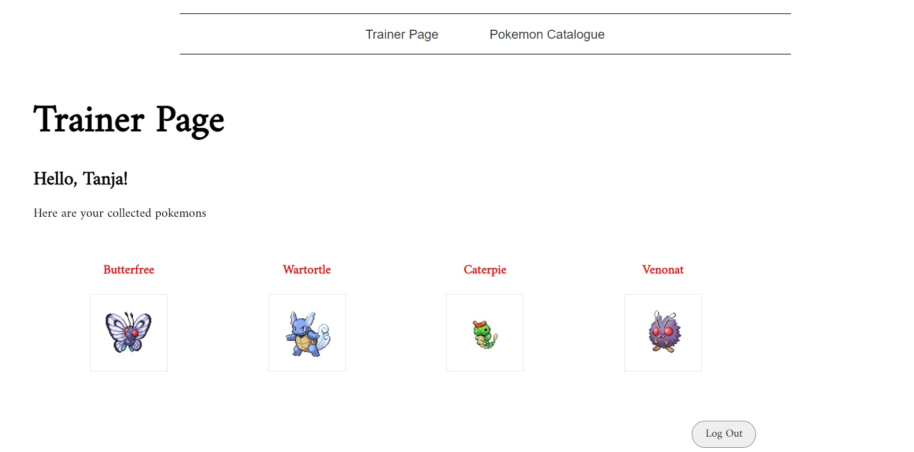

# Pokemon Trainer Angular App

## Project shows use of Angular, TypeScript, Angular CLI, Router, Pipes, Models, Guards, Services, CSS, Tachyons (prebuilt CSS tool), Flexbox, external API

Main functionality: login and pokemon info stored in local storage, trainer page shows content depending on the collection status, pokemon catalogue with an opportunity to choose one pokemon and show its details, opportunity to collect a pokemon (if already collected, the display will change), all data deleted on logout. Error handling.

## Development server

Run `ng serve` for a dev server. Navigate to `http://localhost:4200/`. The app will automatically reload if you change any of the source files.